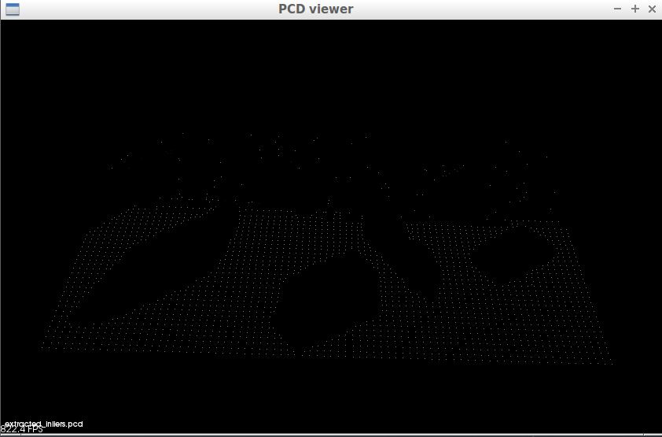
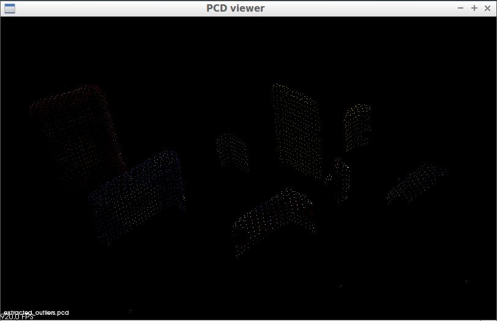
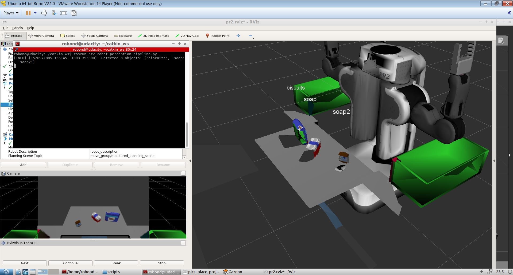
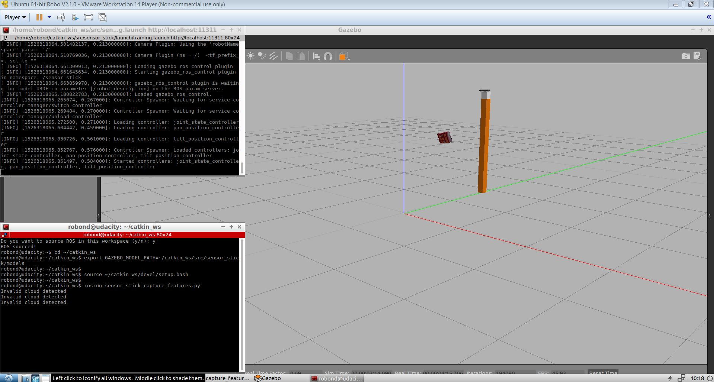
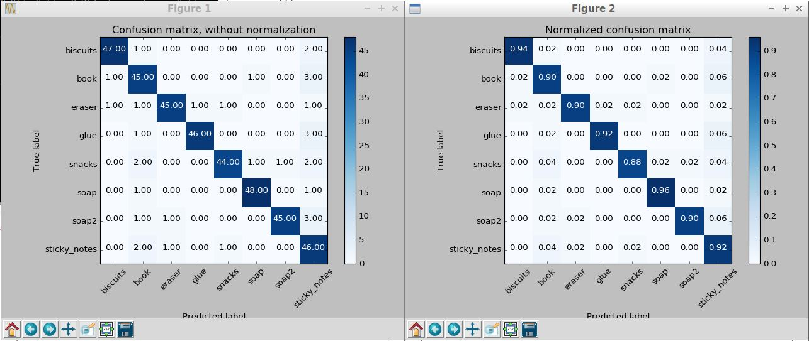
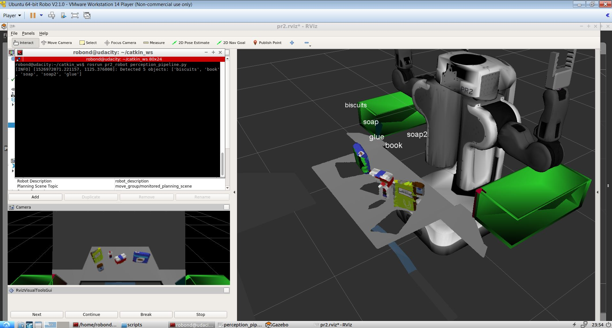
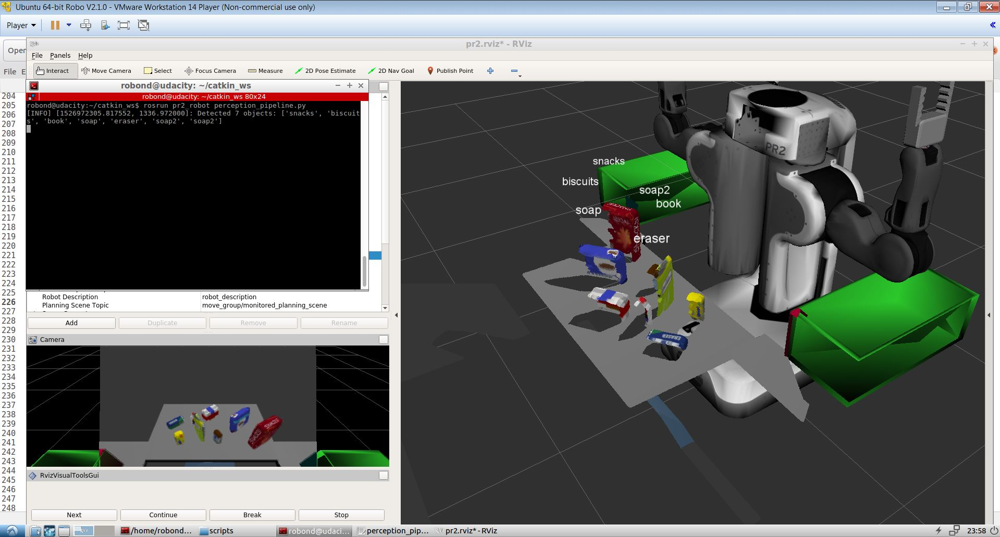

# Project: Perception Pick & Place 

---

## Milestones for the Project:
1. Extracted features and trained an SVM model on new objects. 
2. Wrote a ROS node and subscribed to `/pr2/world/points` topic. This topic contained noisy point cloud data.
3. Used filtering and RANSAC plane fitting to isolate the objects of interest from the rest of the scene.
4. Applied Euclidean clustering to create separate clusters for individual items.
5. Performed object recognition on these objects and assign them labels (markers in RViz).
6. Calculated the centroid (average in x, y and z) of the set of points belonging to that each object.
7. Created ROS messages containing the details of each object (name, pick_pose, etc.) and wrote these messages out to `.yaml` files, one for each of the 3 scenarios (`test1-3.world` in `/pr2_robot/worlds/`). 
8. Code for implementation can be found here [perception_pipeline.py](pr2_robot/scripts/perception_pipeline.py)

## [Rubric](https://review.udacity.com/#!/rubrics/1067/view) Points
### Here I will consider the rubric points individually and describe how I addressed each point in my implementation.  

---
### Writeup / README

You're reading it!

### Implementation of Perception Pipeline
#### 1. Filtering of Noisy Data
I performed filtering using the Statistical Outlier Filter. I used the `mean_k = 20` and `std = 0.1`.  The code for this can be found in lines [65 to 68](pr2_robot/scripts/perception_pipeline.py#L64) 

#### 2. Voxel Grid Downsampling
To reduce the volume of data, I impelemented Voxel Grid downsampling as in Exercise 1. `Leaf Size = 0.01` worked out well.  The code for this can be found in lines [72 to 75](pr2_robot/scripts/perception_pipeline.py#L72)

#### 3. Pass through Filtering
To look only at the relevant region in the data, I performed pass through filtering by selecting region in y and Z axis. This is also same as in as in Exercise 1. It required some tuning to get the right regions. Code is in lines [78 to 92](pr2_robot/scripts/perception_pipeline.py#L78) 

#### 4. RANSAC Plane Segmentation
To extract table from the selected region, I implemented RANSAC plane segmentation. This is same as implemented in Exercise 2. I used `max_distance = 0.01`. I extracted inliers that formed the points as the cloud for table and outliers as points for objects. 
The code can be found in lines [96 to 100](pr2_robot/scripts/perception_pipeline.py#L96)

Result of table points extraction.

Result of object points extraction.

#### 5. Euclidean Clustering
To extract points for each object seperately, I performed Euclidean Clustering as performed in Exercise 2. I used `tolerence = 0.05`, `min size = 100` and 'max size = 2500`. The code for this implementation is 
in lines [110 to 117](pr2_robot/scripts/perception_pipeline.py#L110)

#### 6. Feature Extraction and Prediction
For each of the detected object after clustering, features like histogram of hsv colors and histogram of normals were extracted. Using these features and pre trained model prediction was performed. The code for this step is in lines [146 to 175](pr2_robot/scripts/perception_pipeline.py#L146)
The functions responsible for feature extraction can be found in [features.py](pr2_robot/scripts/features.py)
Once the prediction is performed, each cluster cloud is given a label.

Result of prediction of world 1 is shown here

### Classification Model Creation
#### 1. Data Collection
To create model, first data is collected for each object viewed with different camera angles and points clouds are stored. I created 50 different view points for each object. The script responsible for data collected is [capture_features.py](pr2_robot/scripts/capture_features.py)
For each point cloud 2 sets of features are extracted; histogram of colors and histogram of normals. I used HSV color space and 128 sized bins. For histogram of normals also I used 129 bins.
The functions responsible for feature extraction can be found in [features.py](pr2_robot/scripts/features.py)
These features are stored in a [`training_set.sav`](training_set.sav) file.

Following images shows once instance when data collection was ongoing.

#### 2. Model Building
Using this training data I build a SVM classifier. The script that I used is [train_svm.py](pr2_robot/scripts/train_svm.py) 
I tried 3 different kernels and found `linear` performed the best with value of `C=0.1`. I used 50 fold cross validation. The performance of the classifier can be visualized in the following confusion matrices.

The created model is stored in [`model.sav`](model.sav) which is loaded during real time prediction.

### Pick and Place Setup
The pick and place setup is implemented in the function `pr2_mover()`. It is responsible for following tasks.

#### 1. Read object list and dropbox parameters
Information about sequence in which objects need to be picked and what color box it has to go in is given in object_list yaml file. For each world, there is a separate yaml file. 
Also the information on what color of box is associated with which arm of robot and location of the box is given in dropbox yaml file. The function first reads these files and extract information 
as a list to be used later. The code is in lines [194-212](pr2_robot/scripts/perception_pipeline.py#L194)

#### 2. Object Centers Estimation 
Using the clustered and labeled clouds, for each cluster using its spatial positions, its centroid is obtained by taking mean in x,y,z axis. A list of centers and labels is created to be used later.  Code is in lines [216-222](pr2_robot/scripts/perception_pipeline.py#L216)

#### 3. Iteration thorugh pick list and Creation of Output
For each object in pick list using its name as label, name is searched in the detected list of objects. If found output is created by definint pick pose positions as the centers of the identified object. To create place pose, using the group information, arm information and target box position is fetched. This is used in place pose information. Using all this information a yaml dictionary is created and the 
dictionary is appended in a list. This information is also passed to service `pick_place_routine` to be used form movement of robots. The complete information is written to an output yaml file. 
This process is repeated for all the three worlds. The code can be found in lines [228 to 276](pr2_robot/scripts/perception_pipeline.py#L228)

The resultant output files can be found here.

1. [`output_1.yaml`](pr2_robot/config/output_1.yaml)
2. [`output_2.yaml`](pr2_robot/config/output_2.yaml)
3. [`output_3.yaml`](pr2_robot/config/output_3.yaml)

The screenshots showing the output of detection for different worlds is as follows

1. World 1

2. World 2

3. World 3

### Discussion and Possible Improvements
I still believe that there is scope of tuning parameters in the perception pipeline. Also a better model for classification can be built by adding more features and tuning the classifier model itself. For the next steps in the project
first thing would definitely be making collision map. Once the map is created, then using it to move the robot. 

